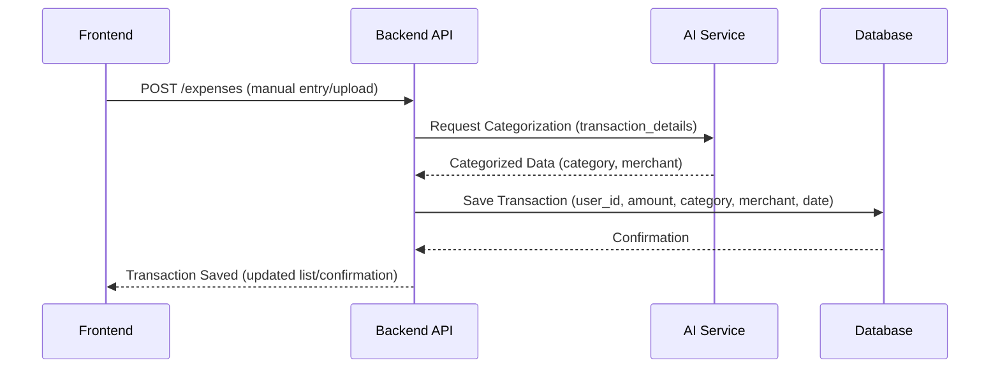
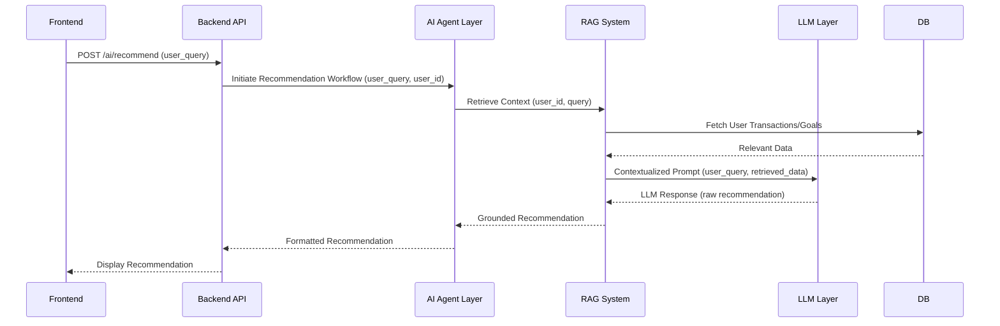

# API Flow Documentation

## Purpose
To illustrate the interaction sequences between the frontend, backend, and AI/database services for key features, detailing the data flow and API endpoints involved.

## Responsibilities
- Define clear communication contracts between different system components.
- Document data exchange formats and processing steps for critical workflows.
- Ensure consistent and secure data flow across the application.

## Workflow: Expense Categorization

*User logs expense -> Frontend sends to Backend -> Backend requests AI categorization -> AI returns category -> Backend saves to DB -> Confirmation to Frontend*

## Workflow: Recommendation Generation

*User asks for recommendation -> Frontend sends to Backend -> Backend initiates AI Agent -> Agent uses RAG to fetch data from DB -> RAG crafts prompt for LLM -> LLM generates response -> Recommendation formatted and sent to Frontend*

## Components
- **RESTful APIs:** Standard HTTP methods (GET, POST, PUT, DELETE) for resource interaction.
- **JSON Payloads:** Data exchange format between frontend, backend, and internal services.
- **Backend Endpoints:** e.g., `/expenses`, `/budgets`, `/goals`, `/ai/query`, `/auth`.
- **Internal Service Calls:** Direct calls or message queues for communication between backend and AI/RAG layers.

## Future Scalability Notes
- API versioning to manage changes without breaking existing clients.
- Use of API Gateway for centralized request handling, rate limiting, and security.
- Introduction of asynchronous processing with message queues for long-running AI tasks.