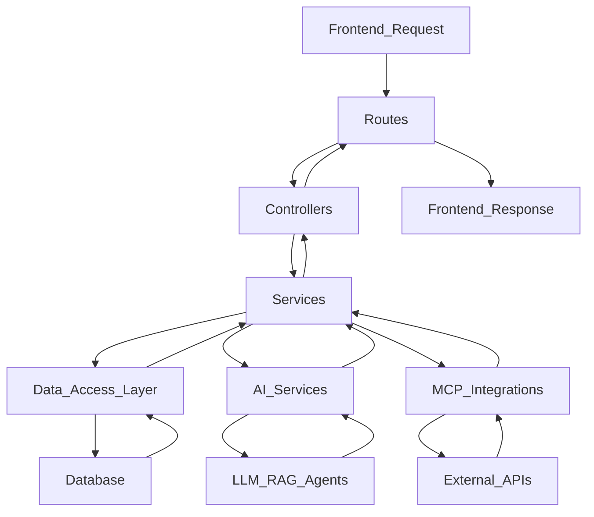

# Backend Architecture

## Purpose
To outline the server-side structure, API design, and core business logic that drives the AI Finance Agent application, ensuring secure, efficient, and scalable operations.

## Responsibilities
- Provide RESTful APIs for frontend communication.
- Implement authentication, authorization, and security measures.
- Manage data persistence, retrieval, and business logic.
- Orchestrate interactions with AI services and external integrations (MCP).
- Handle expense categorization, budget management, and financial calculations.

## Workflow

*API Request -> Routing -> Controller (Request Handling) -> Service (Business Logic, AI/DB Orchestration) -> Data Layer/AI Services -> Response*

## Components
- **Framework:** Node.js with Express.js.
- **Routes:** Define API endpoints and direct requests to controllers.
- **Controllers:** Handle incoming HTTP requests, validate input, and delegate tasks to services.
- **Services:** Encapsulate business logic, interact with data models, AI services, and external APIs.
- **Data Access Layer (`data/`):** Manages interactions with PostgreSQL and MongoDB (ORM/ODMs).
- **Prompts (`prompts/`):** Stores templates for AI prompts to ensure consistent LLM interaction.
- **Authentication Middleware:** JWT authentication, OAuth.
- **Validation:** Input validation for API requests.

## Future Scalability Notes
- Designed for horizontal scaling of Express.js instances.
- Potential for decomposing into domain-specific microservices for greater autonomy and scalability.
- Implementation of API Gateway for managing traffic, security, and versioning across multiple services.