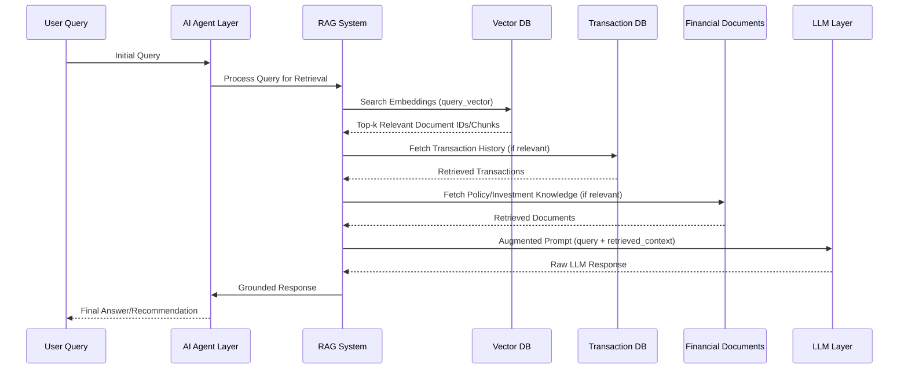

# Retrieval Augmented Generation (RAG) Plan

## Purpose
To outline the architecture and workflow of the RAG system, enabling the LLM Layer to generate grounded, context-aware, and accurate financial insights by retrieving relevant information from diverse data sources.

## Responsibilities
- Index and store financial documents and user-specific transaction history.
- Efficiently retrieve relevant context based on user queries.
- Augment LLM prompts with retrieved information to prevent hallucinations and improve accuracy.
- Ensure privacy and security of retrieved user financial data.

## Workflow

*User Query -> AI Agent -> RAG (Retrieval) -> Vector DB/Transaction DB/Financial Docs -> RAG (Augmentation) -> LLM -> Grounded Response -> AI Agent -> User*

## Components
- **Documents:** User transaction history (PostgreSQL), financial documents (MongoDB), investment knowledge bases, policy information.
- **Chunking:** Process of breaking down large documents into smaller, manageable text chunks.
- **Embeddings:** Vector representations of text chunks and user queries, generated by a language model.
- **Vector Database (Vector DB):** Stores text embeddings for efficient similarity search (e.g., Pinecone, Weaviate, or a self-hosted solution).
- **Retriever:** Module responsible for querying the Vector DB and potentially other databases to fetch the most relevant text chunks or data.
- **LLM Layer:** Large Language Models (GPT, Gemini, Claude, Llama) that receive the augmented prompt.
- **LangChain/LangGraph:** Frameworks for orchestrating the RAG workflow, managing agents, and integrating different components.

## Future Scalability Notes
- **Real-time Indexing:** Develop pipelines for real-time indexing of new user transactions or uploaded documents into the Vector DB.
- **Advanced Retrieval Algorithms:** Explore more sophisticated retrieval methods (e.g., hybrid search, re-ranking) to improve relevance.
- **Multi-modal RAG:** Extend to include retrieval from other data types like tables or images, if necessary.
- **Scalable Vector Stores:** Utilize cloud-native vector databases or distributed vector search engines to handle massive amounts of embeddings and high query loads.