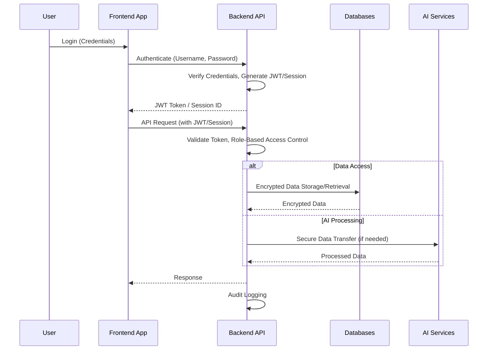

# Security Plan

## Purpose
To define the comprehensive security measures, protocols, and best practices implemented across the AI Finance Agent application to protect sensitive financial data, ensure user privacy, and maintain system integrity.

## Responsibilities
- Implement robust authentication and authorization mechanisms.
- Encrypt data at rest and in transit to prevent unauthorized access.
- Monitor for suspicious activities and prevent fraud.
- Adhere to industry best practices for secure software development and deployment.
- Maintain audit logs for accountability and incident response.

## Workflow

*User Login -> Authentication -> Authorized API Requests (with secure tokens) -> Data Encryption (at rest & in transit) -> Access Control -> Audit Logging*

## Components
- **Authentication:**
    -   **JWT (JSON Web Tokens):** For stateless authentication and API authorization.
    -   **OAuth Login:** Support for third-party identity providers.
    -   **MFA (Multi-Factor Authentication):** Optional for enhanced user security.
    -   **Secure Password Hashing:** Use strong, salted hashing algorithms (e.g., bcrypt).
-   **Authorization:**
    -   **Role-Based Access Control (RBAC):** Restrict access to features and data based on user roles.
    -   **API Validation:** Strict input validation for all API endpoints to prevent injection attacks and malformed requests.
-   **Data Security:**
    -   **Encryption at Rest:** Encrypt sensitive data stored in PostgreSQL and MongoDB (e.g., using disk encryption or column-level encryption).
    -   **Encryption in Transit (TLS/SSL):** All communication between frontend, backend, and external services must use HTTPS/TLS.
    -   **Secure Token Handling:** Store tokens securely, avoid exposure in logs, and implement refresh token mechanisms.
-   **Fraud Detection:**
    -   **Anomaly Detection:** AI-driven analysis to identify unusual spending patterns.
    -   **Suspicious Activity Alerts:** Automated alerts for unusual transactions or login attempts.
-   **Audit Logging:** Comprehensive logging of all critical actions, security events, and data access attempts.
-   **Secure Development Practices:** Adherence to OWASP Top 10, regular security reviews, and dependency scanning.
-   **Session Management:** Secure session expiration, invalidation, and prevention of session hijacking.

## Future Scalability Notes
- **Centralized Security Information and Event Management (SIEM):** Integrate audit logs into a SIEM system for advanced threat detection and analysis.
- **Automated Security Testing:** Implement continuous security testing (SAST, DAST) in CI/CD pipelines.
- **Compliance Automation:** Develop tools and processes to ensure ongoing compliance with relevant financial regulations (e.g., GDPR, CCPA).
- **Zero Trust Architecture:** Evolve towards a zero-trust model where every request is authenticated and authorized, regardless of origin.